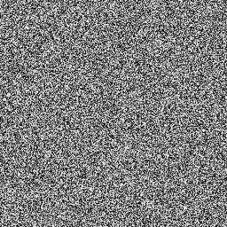
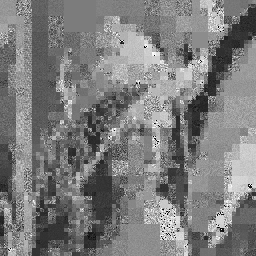
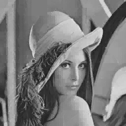

# fractal-image-compression

A from-scratch, NumPy-only implementation of **fractal image compression**: encode a grayscale image as a set of contractive affine maps, then reconstruct it by iterating those maps from a random seed until they converge to the image's attractor.

A study / exploratory project — a compact, dependency-light take on Jacquin–Fisher-style fractal coding with an adaptive quadtree partition.

## Quick start

Decode the bundled Lena 256×256 sample and watch the attractor converge, saving one image per iteration:

```bash
uv run python main.py \
    --decode examples/lena.json.gz \
    --output examples/lena-decoded.png \
    --iterations 5 \
    --save_iterations
```

This writes `examples/lena-decoded_iter000.png` (random seed) through `examples/lena-decoded_iter05.png` (converged result):

| iter 0 | iter 1 | iter 2 | iter 3 | iter 4 | iter 5 |
|:------:|:------:|:------:|:------:|:------:|:-------:|
|  |  |  |  |  |  |

## Background

Fractal compression models an image as the fixed point of a **partitioned iterated function system** (PIFS). Each range block in the image is approximated by an affine transform of some (larger) domain block taken from the same image:

```
R(x, y) ≈ s · D(x, y) + b
```

where `s` is a contractive scale factor and `b` is a brightness offset. The collection of such maps forms a contractive operator on image space, so by Banach's fixed-point theorem, iterating the maps from any starting image converges to a unique attractor that approximates the original.

## How it works

### Encoder (`encoder.py`)

- Builds the **domain pool** from the 8 isometries of the D4 dihedral group (4 rotations + horizontal flip + 4 rotations of the flip) applied to the source image.
- Extracts candidate domain blocks at multiple sizes (up to 64×64) and downsample factors (2, 4, 8, 16), so each domain can be matched against range blocks that are 1/2, 1/4, 1/8, or 1/16 its linear size.
- Starts with a uniform grid of 32×32 range blocks. For each one, finds the best-fitting domain by **closed-form least squares** for `s` and `b`, with:
  - contractivity enforced: `s ∈ [0, 0.95]`, quantized to 8 levels
  - brightness: `b ∈ [0, 1]`, quantized to 100 levels
- If the best match exceeds the error threshold, the range block is **quadtree-split** into four sub-blocks and each is re-matched independently. Splitting stops at a 4×4 floor.
- Writes a **JSON** file (`fractal-pifs` format) with the source image size once at the top level and a `transforms` array: each entry has domain location/size, downsample scale, range location/size, and quantized `s` / `b` (plus recorded fit error).

### Decoder (`decoder.py`)

- Starts from a random image of the size stored in the JSON (`image_height` × `image_width`).
- Each iteration: rebuilds the 8-fold D4 domain pool from the current estimate, applies every transform in the file to fill the corresponding range block, then replaces the estimate with the result.
- After a handful of iterations the estimate converges to the attractor of the map set — a reconstruction of the encoded image.

## Layout

```
fractal-image-compression/
├── main.py             CLI: --encode / --decode
├── encoder.py          Encoder + Transformation record + closed-form affine fit
├── decoder.py          Decoder (Banach fixed-point iteration from random seed)
├── examples/           Bundled sample data and decode outputs
│   └── lena-256x256.json.gz   Pre-encoded 256×256 Lena (fractal-pifs format)
├── pyproject.toml      Project metadata and dependencies (UV / PEP 621)
├── uv.lock             Lockfile (reproducible installs with uv)
└── requirements.txt    Same deps as a plain list (optional pip)
```

## Usage

```bash
# Encode a grayscale image to a JSON transform file
python main.py --encode path/to/image.png --output transforms.json \
    --error_threshold 0.01 --verbose

# Decode the JSON back to an image (canvas size comes from the file)
python main.py --decode transforms.json --output reconstructed.png \
    --iterations 6
```

The encoder converts RGB inputs to grayscale via `Image.convert('L')`. Optional `--image_size HxW` on decode overrides the stored canvas size.

## Install

With [uv](https://github.com/astral-sh/uv) (creates `.venv` and installs from `uv.lock`):

```bash
git clone https://github.com/omidsakhi/fractal-image-compression.git
cd fractal-image-compression
uv sync
```

Run the CLI without activating the venv: `uv run python main.py --encode ...`

Without uv, use a venv and pip:

```bash
python -m venv .venv
# Windows: .venv\Scripts\activate
source .venv/bin/activate
pip install -r requirements.txt
```

Dependencies: `numpy`, `Pillow`, `tqdm`.

## Limitations

- **Grayscale only** — the encoder converts any input to single-channel luminance (`Image.convert('L')`). Color information is discarded; there is no per-channel or YCbCr encoding path.
- **Image dimensions should be a multiple of the range block size** — the initial range grid tiles the image in steps of `max_range_size` (default 32). Pixels in a rightmost or bottommost strip that don't form a full tile are silently skipped during encoding.
- **Performance scales poorly with resolution** — the brute-force domain search is O(|range blocks| · |domain blocks|) per size class. A 256×256 image takes a few minutes; significantly larger images become impractical without algorithmic changes.

## Notes

- Uses the standard Jacquin / Fisher framing with the D4 symmetry group on the domain pool — 8 isometries per size class.
- Both `s` and `b` are quantized; this is the typical route to turning a continuous affine map into a cheap, compact record.
- Pure NumPy — no OpenCV, no torch, no GPU. This is a readable study implementation, not a production codec.
- The `IntegralImage` class in `encoder.py` is wired in as a potential optimization for fast block-sum queries but isn't on the active match path.

## License

Licensed under the Apache License 2.0 — see [LICENSE](LICENSE).
